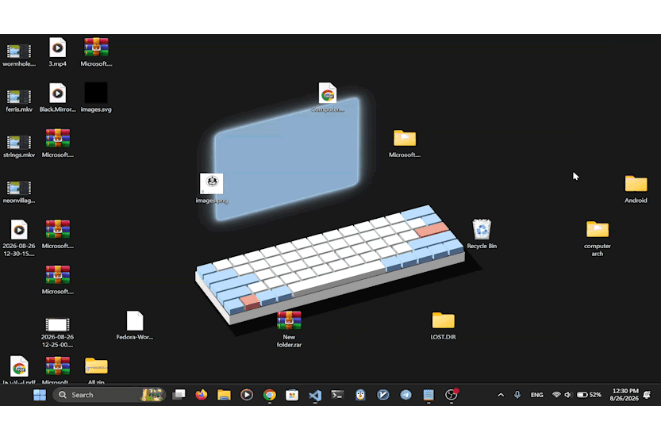
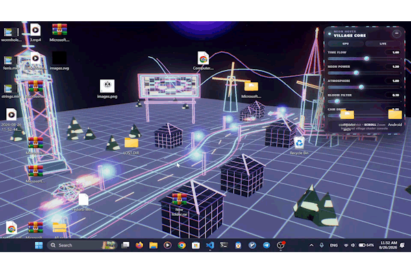
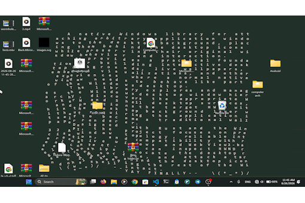
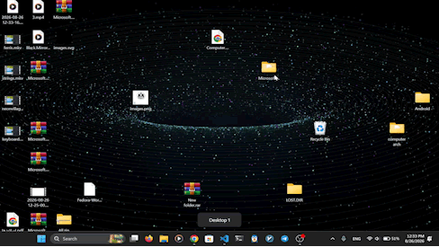

# Wallopino

**Wallopino** is a Windows-focused Rust library for turning an ordinary application window into an interactive desktop wallpaper.

Instead of forcing your application to implement a traditional wallpaper renderer, Wallopino works with an existing `HWND` and integrates it into the Windows desktop window hierarchy. This makes it possible to build **interactive live wallpapers, desktop visualizations, WebView-based backgrounds, animated scenes, and other desktop experiences** using the UI technology or rendering engine you already like.

> **Status:** `0.1.0` — early-stage / experimental API.

[](https://www.rust-lang.org/)
[](https://www.microsoft.com/windows)
[](LICENSE)

---

## Showcase

See Wallopino in action. Each example below is a normal application window transformed into an animated desktop wallpaper.

### 🦀 Ferris

**Native Macroquad rendering with desktop attachment and interactive mouse input.**


---

### ⌨️ Keyboard

**Interactive WebView content built with Wry/Tao, attached to the desktop with forwarded mouse input.**



---

### 🌆 Neon Village

**A large animated WebView/Three.js-style scene running directly as an interactive desktop background.**



---

### ✨ Strings

**An animated WebView experience attached to the Windows desktop.**



---

### 🕳️ Wormhole

**A WebView-based animated black-hole scene running behind the desktop icons.**




---

## Why Wallopino?

Windows desktop wallpaper is more than a single background image. The Shell maintains a hierarchy of windows for the desktop, icons, wallpaper surfaces, and other system UI.

Wallopino provides the low-level plumbing needed to work with that hierarchy:

* Attach an existing window behind the desktop icons.
* Work across multiple monitors.
* Normalize monitor coordinates for a virtual desktop.
* Watch the desktop hierarchy and repair wallpaper z-order changes.
* Capture global mouse and keyboard input.
* Forward captured input as normal Windows messages to the target window.
* Redirect forwarded events to a descendant window when frameworks such as WebView2 need it.
* Track mouse button state for frame-based applications.
* Clean up the wallpaper integration when the application shuts down.

The core idea is simple:

```text
Your application
      │
      │ creates a normal HWND
      ▼
   Wallopino
      │
      ├── Attach HWND to Windows desktop layer
      │
      ├── Keep desktop z-order stable
      │
      └── Optionally forward mouse/keyboard input
      ▼
Interactive desktop wallpaper
```

---

## Features

### 🖥️ Window-to-desktop attachment

Attach an existing window to the Windows desktop layer with:

```rust
let mut wallpaper = wallopino::AttachWindow::auto_attach(hwnd, true)?;
```

Wallopino discovers the relevant desktop windows and configures the target `HWND` accordingly.

### 🧱 Desktop hierarchy / z-order watching

Desktop window topology can change while Windows is running. Wallopino can start a background watcher to detect relevant changes and restore the wallpaper placement:

```rust
wallopino.start_watcher(std::time::Duration::from_millis(100))?;
```

You can stop the watcher explicitly with `stop_watcher()`.

### 🖱️ Global mouse input forwarding

`EventForwarder` can capture low-level mouse input and forward it to your wallpaper window:

```rust
let forwarder =
    wallopino::EventForwarder::new(hwnd, None, true, false)?;

let controller = forwarder.forward_events()?;
```

Supported mouse events include movement, left/right/middle button press/release, and wheel scrolling.

### ⌨️ Keyboard input forwarding

Keyboard forwarding can be enabled independently:

```rust
let forwarder =
    wallopino::EventForwarder::new(hwnd, None, false, true)?;

let controller = forwarder.forward_events()?;
```

Mouse and keyboard forwarding can also be enabled together.

### 🎯 Descendant-window targeting

Some UI frameworks do not process input on the top-level `HWND`. Wallopino can search the target's descendants for a specific window class and use that child as the forwarding destination:

```rust
let forwarder = wallopino::EventForwarder::new(
    hwnd,
    Some("Chrome_WidgetWin_1"),
    true,
    false,
)?;
```

This is particularly useful for WebView2/Wry-style applications.

### 🖥️ Multi-monitor support

Wallopino can enumerate connected monitors and normalize their coordinates into a virtual-desktop coordinate system:

```rust
let monitors = wallpaper.enumerate_monitors()?;

for (index, monitor) in monitors.iter().enumerate() {
    println!(
        "Monitor {index}: ({}, {}) {}x{}",
        monitor.x,
        monitor.y,
        monitor.width,
        monitor.height
    );
}
```

It also exposes monitor work-area information through `MonitorInfo`.

### 🖱️ Frame-based mouse state

For render loops and game-style applications, `AttachWindow` can track the current and previous state of five mouse buttons:

```rust
wallpaper.update_mouse_state();

if wallpaper.is_mouse_button_pressed(0) {
    println!("Left click!");
}

if wallpaper.is_mouse_button_down(0) {
    println!("Left button is held.");
}

if wallpaper.is_mouse_button_released(0) {
    println!("Left button released.");
}
```

Button indices are:

| Index | Button |
| ----: | ------ |
|   `0` | Left   |
|   `1` | Right  |
|   `2` | Middle |
|   `3` | X1     |
|   `4` | X2     |

---

## Installation

Wallopino is currently developed as a Windows-specific crate.

### From GitHub

```toml
[dependencies]
wallopino = { git = "https://github.com/amir-frjn/wallopino" }
```

If your application directly uses Windows types such as `HWND`, add the `windows` crate as a direct dependency too:

```toml
[target.'cfg(windows)'.dependencies]
wallopino = { git = "https://github.com/amir-frjn/wallopino" }
windows = { version = "0.61", features = [
    "Win32_Foundation",
    "Win32_UI_WindowsAndMessaging",
] }
```

Wallopino currently uses the `windows` crate version `0.61` internally.

---

## Quick Start

The following example shows the basic Wallopino workflow.

```rust
use std::time::Duration;

use wallopino::AttachWindow;

fn attach_wallpaper(hwnd: isize) -> Result<(), Box<dyn std::error::Error>> {
    // Attach the existing window to the desktop.
    let mut wallpaper = AttachWindow::auto_attach(hwnd, true)?;

    // Keep the attachment alive when Windows changes desktop window topology.
    wallpaper.start_watcher(Duration::from_millis(100))?;

    Ok(())
}
```

The `hwnd` is the normal Windows handle of the window you want to use as the wallpaper.

For example, frameworks that expose a native Windows handle, such as `tao`, can provide the `HWND` for you.

---

## Interactive Wallpaper

Wallopino becomes especially interesting when the wallpaper is interactive.

A typical application has two independent pieces:

1. **Attach the window to the desktop**
2. **Forward input to that window when required**

```rust
use std::time::Duration;

let event_forwarder =
    wallopino::EventForwarder::new(hwnd, None, true, false)?;

let controller = event_forwarder.forward_events()?;

let mut wallpaper =
    wallopino::AttachWindow::auto_attach(hwnd, true)?;

wallpaper.start_watcher(Duration::from_millis(100))?;

// ... run your application ...

controller.pause();
controller.resume();

// Shut down the forwarding session when finished.
controller.exit()?;
```

The forwarding controller is thread-safe and can pause, resume, query, or terminate an active forwarding session.

---

## WebView / Wry Example

One of Wallopino's useful applications is combining it with a WebView.

The repository contains examples built with [`wry`](https://github.com/tauri-apps/wry) and [`tao`](https://github.com/tauri-apps/tao). The important part is still very small:

```rust
use std::time::Duration;
use tao::platform::windows::WindowExtWindows;

let hwnd = window.hwnd();

let event_forwarder =
    wallopino::EventForwarder::new(
        hwnd,
        Some("Chrome_WidgetWin_1"),
        true,
        false,
    )?;

event_forwarder.forward_events()?;

let mut wallpaper =
    wallopino::AttachWindow::auto_attach(hwnd, true)?;

wallpaper.start_watcher(Duration::from_millis(100))?;
```

For WebView-based windows, the top-level window may not be the element that actually processes mouse messages. The optional descendant class-name parameter lets Wallopino target an appropriate child window instead.

---

## Examples

The [`examples/`](examples) directory contains several complete demos.

| Example                                     | What it demonstrates                                                                       | Video                             |
| ------------------------------------------- | ------------------------------------------------------------------------------------------ | --------------------------------- |
| [`ferris.rs`](examples/ferris.rs)           | Native rendering with Macroquad, desktop attachment, and interactive mouse input           | [▶️ Demo](assets/Ferris.mp4)      |
| [`keyboard.rs`](examples/keyboard.rs)       | Interactive WebView content with Wry/Tao, desktop attachment, and forwarded mouse input    | [▶️ Demo](assets/Keyboard.mp4)    |
| [`neonvillage.rs`](examples/neonvillage.rs) | A large WebView/Three.js-style animated scene running as an interactive desktop background | [▶️ Demo](assets/Neonvillage.mp4) |
| [`strings.rs`](examples/strings.rs)         | A WebView animation attached to the desktop                                                | [▶️ Demo](assets/Strings.mp4)     |
| [`wormhole.rs`](examples/wormhole.rs)       | A WebView-based animated black-hole scene attached to the desktop                          | [▶️ Demo](assets/Wormhole.mp4)    |

Run an example with:

```bash
cargo run --example ferris
```

or:

```bash
cargo run --example keyboard
```

The examples are intentionally useful as reference implementations: each one shows how a normal application window can be converted into a desktop background rather than building a dedicated wallpaper renderer from scratch.

---

## Architecture

At a high level, Wallopino is split into two responsibilities.

### `AttachWindow`

`AttachWindow` is responsible for the desktop side of the problem.

It can:

* discover the relevant Windows desktop windows,
* select a monitor or the virtual desktop,
* configure the target `HWND`,
* enumerate monitors,
* calculate desktop-relative mouse coordinates,
* maintain mouse button state,
* watch the wallpaper's z-order,
* stop the watcher,
* restore desktop state during cleanup.

The most convenient entry point is:

```rust
AttachWindow::auto_attach(hwnd, static_edge_mode)
```

For more control, the lower-level flow is:

```text
AttachWindow::initialize()
        │
        ▼
enumerate_monitors()
        │
        ▼
get_wallpaper_target(...)
        │
        ▼
configure_wallpaper_window(...)
        │
        ▼
start_watcher(...)
```

### `EventForwarder`

`EventForwarder` handles input.

Internally it uses low-level Windows hooks to capture selected input events, then forwards those events as Windows messages to the selected target window.

Its lifecycle looks like:

```text
EventForwarder::new(...)
        │
        ▼
forward_events()
        │
        ▼
ForwardingController
      /   |    \
     /    |     \
 pause  resume  exit
```

This separation is useful because not every wallpaper needs input forwarding. Static visualizations can use only `AttachWindow`, while interactive wallpapers can opt into `EventForwarder`.

---

## Input Events

Wallopino exposes an `Events` enum representing captured input:

```rust
use wallopino::Events;

let event = Events::LeftDown { x: 100, y: 200 };

println!("{event:?}");
```

Current event categories include:

### Mouse

* `Move`
* `LeftDown`
* `LeftUp`
* `RightDown`
* `RightUp`
* `MiddleDown`
* `MiddleUp`
* `Scroll`

### Keyboard

* `KeyDown`
* `KeyUp`

Mouse coordinates are converted from screen coordinates toward the target window's client coordinate system before the corresponding Windows message is posted.

---

## Controlling Input Forwarding

`ForwardingController` lets you manage a running forwarding session:

```rust
let controller = forwarder.forward_events()?;

// Temporarily stop forwarding.
controller.pause();

// Continue forwarding.
controller.resume();

// Check the current state.
if controller.is_forwarding() {
    println!("Forwarding is active.");
}

// Permanently terminate the forwarding session.
controller.exit()?;
```

Dropping the controller also signals the forwarding thread to terminate.

---

## Cleanup

When the wallpaper is no longer needed, you can explicitly clean up the attachment:

```rust
wallpaper.cleanup()?;
```

The watcher can also be stopped directly:

```rust
wallpaper.stop_watcher()?;
```

`AttachWindow` also cleans up its watcher when it is dropped.

---

## `static_edge_mode`

`auto_attach` accepts a second boolean parameter:

```rust
AttachWindow::auto_attach(hwnd, true)
```

This controls the library's static-edge attachment mode.

The examples use `true`, particularly for applications where keeping the wallpaper anchored to the desktop hierarchy is important.

---

## Platform Support

Wallopino is currently **Windows-only**.

The crate is designed around the Win32 desktop window hierarchy and uses the Windows API for:

* window discovery,
* desktop window management,
* monitor enumeration,
* input hooks,
* cursor state,
* z-order maintenance,
* desktop wallpaper restoration.

The project currently targets modern Windows desktop environments and is primarily developed/tested around Windows 10 and Windows 11.

---

## Requirements

* Windows
* Rust (edition 2024)
* A Windows desktop application that exposes a native `HWND`

Optional libraries such as `wry`, `tao`, or `macroquad` can be used alongside Wallopino depending on how you render your wallpaper.

---

## Use Cases

Wallopino can be used as a foundation for:

* Interactive live wallpapers
* WebView-based desktop backgrounds
* Three.js / Canvas visualizations
* Macroquad or other native rendering engines
* Animated desktop widgets
* Audio-reactive desktop scenes
* Experimental desktop environments
* Applications that need a normal window to live behind desktop icons

The important distinction is that **Wallopino does not dictate how your wallpaper is rendered**.

You can render it using native graphics, a game engine, WebView, HTML/CSS/JavaScript, or another window-based technology—as long as you have a window handle to attach.

---

## Project Layout

```text
wallopino/
├── assets/
│   ├── Ferris.mp4
│   ├── Keyboard.mp4
│   ├── Neonvillage.mp4
│   ├── Strings.mp4
│   └── Wormhole.mp4
├── examples/
│   ├── ferris.rs
│   ├── keyboard.rs
│   ├── neonvillage.rs
│   ├── strings.rs
│   └── wormhole.rs
├── src/
│   ├── platform/
│   │   └── windows/
│   └── lib.rs
├── Cargo.toml
├── LICENSE
└── README.md
```

---

## Public API

The main items re-exported by the crate are:

```rust
wallopino::AttachWindow
wallopino::EventForwarder
wallopino::ForwardingController
wallopino::Events
wallopino::functions
```

For detailed API documentation, see the Rust documentation generated from the crate source.

---

## Safety

Wallopino interacts directly with Win32 APIs and therefore contains `unsafe` code internally.

Because the library operates on real Windows handles and global input hooks:

* pass valid window handles,
* ensure your target window remains alive while it is being used,
* stop forwarding sessions when they are no longer needed,
* be mindful that global input hooks affect the entire desktop session.

Wallopino does not try to hide the low-level nature of this functionality; it wraps the Windows-specific plumbing so the application can focus on the wallpaper itself.

---

## Contributing

Issues, experiments, improvements, and Windows-specific findings are welcome.

Because the project is still young, API design may evolve between releases.

For development:

```bash
git clone https://github.com/amir-frjn/wallopino.git
cd wallopino

cargo check
cargo test
cargo run --example ferris
```

---

## License

Wallopino is licensed under the [MIT License](LICENSE).

---

## Credits & Inspiration

Wallopino was created as a Rust-oriented exploration of the Windows desktop window hierarchy and the techniques required to build interactive desktop backgrounds.

Some example visuals are inspired by public CodePen projects; the example source files contain the relevant attribution and inspiration notes.

---

## Roadmap

Some directions that fit naturally with the project include:

* Better multi-monitor wallpaper management
* More robust desktop topology recovery
* Cleaner high-level APIs for wallpaper engines
* Improved event-target discovery for WebView frameworks
* More rendering-framework examples
* Better automated testing around Windows desktop state changes
* Expanded platform abstraction for future non-Windows implementations

---

## The idea in one line

> **Build your desktop experience as a normal window. Let Wallopino put it where the wallpaper belongs.**
